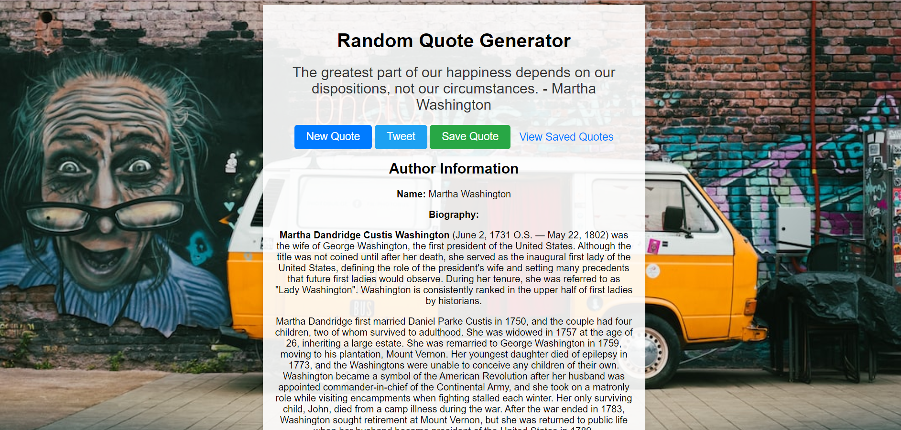

# Random Quote Generator

A web application that generates random quotes and allows users to tweet them. This project is designed to provide users with inspirational and thought-provoking quotes at the click of a button.



## Features

- Fetches random quotes from an external API.
- Allows users to generate new quotes with the "New Quote" button.
- Provides the option to tweet quotes with the "Tweet" button.
- Displays author information, including name, birth date, death date, and biography.
- Allows users to save their favorite quotes using the "Save Quote" button.
- Provides a link to view saved quotes in a separate page.

## Technologies Used

- HTML
- CSS
- JavaScript
- Express.js (for the backend server)
- Node.js
- Fetch API (for making API requests)
- Unsplash API (for fetching random background images)
- Twitter Web Intent (for tweeting quotes)

## How to Use

1. Clone the repository to your local machine:

   ```bash
   git clone https://github.com/dainty92/random-quote-generator.git
   ```

2. Navigate to the project directory:

   ```bash
   cd random-quote-generator
   ```

3. Install the project dependencies:

   ```bash
   npm install
   ```

4. Start the server:

   ```bash
   node app.js
   ```

5. Open your web browser and visit [http://localhost:3001](http://localhost:3001) to use the Random Quote Generator.

## Author Information

- Author: Esther AJAYI
- Contact: estheradexdainty@gmail.com

## Contributing

Contributions are welcome! If you'd like to contribute to this project, please follow these steps:

1. Fork the repository.
2. Create a new branch for your feature or bug fix: `git checkout -b feature-name`.
3. Make your changes and commit them: `git commit -m 'Add new feature'`.
4. Push to your branch: `git push origin feature-name`.
5. Create a pull request with a clear description of your changes.
